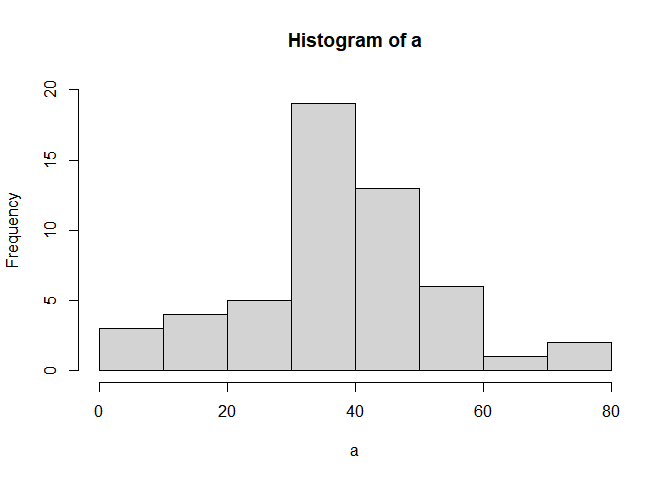
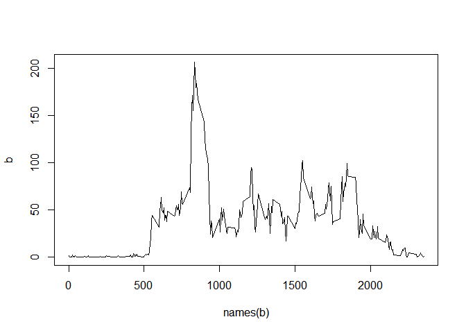
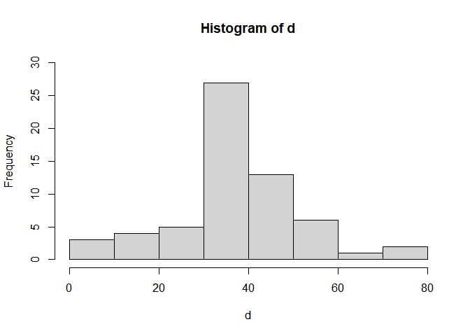
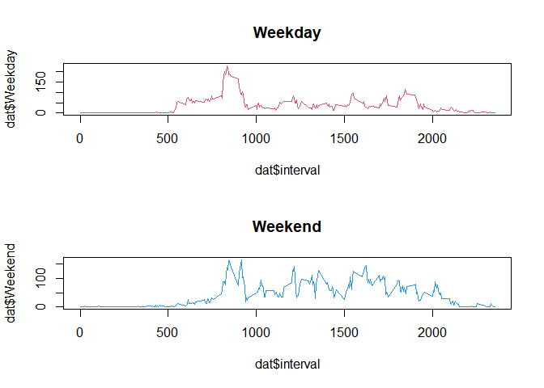

##Loading and preprocessing the data
1.First set the working directory to the location of choice using *setwd* command.  
2.Download zip file using *download.file*.Unzip it and store it a variable.  
3.Read the CSV file using *read.csv* and store it in a variable named "data".  
4.Use head command on data variable.  

```r
setwd("C:\\Users\\luv\\Desktop\\Online Courses\\DATA SCIENCE\\Reproducible Research")
download.file("https://d396qusza40orc.cloudfront.net/repdata%2Fdata%2Factivity.zip","repdata_data_activity.zip")
datafile<-unzip("repdata_data_activity.zip","activity.csv")
data<-read.csv("activity.csv")
head(data)
```

```
##   steps       date interval
## 1    NA 2012-10-01        0
## 2    NA 2012-10-01        5
## 3    NA 2012-10-01       10
## 4    NA 2012-10-01       15
## 5    NA 2012-10-01       20
## 6    NA 2012-10-01       25
```
## What is mean total number of steps taken per day?
  The mean number of steps per day is .  

```r
a<-tapply(data$steps,data$date,mean,na.rm=TRUE)

mean(a,na.rm = TRUE)
```

```
## [1] 37.3826
```
The median is 

```r
median(a,na.rm = TRUE)
```

```
## [1] 37.37847
```
The histogram

```r
hist(a,ylim = c(0,20))
```

<!-- -->

## What is the average daily activity pattern?
 The average daily pattern by interval of time is .  

```r
b<-tapply(data$steps,data$interval,mean,na.rm=TRUE)
c<-as.numeric(names(b))
mean(b,na.rm = TRUE)
```

```
## [1] 37.3826
```

```r
plot(names(b),b,type = 'l')
```

<!-- -->
The max value is 

```r
max(b)
```

```
## [1] 206.1698
```
The max value is at 

```r
which.max(b)
```

```
## 835 
## 104
```

## Imputing missing values
The mean after imputing is  

```r
newdata=data

sum(is.na(data$steps))
```

```
## [1] 2304
```

```r
for (i in 1:length(data$date))
 if(is.na(data$steps[i])==TRUE)
 {
   g=data$interval[i]
   newdata$steps[i]=b[c==g]
 } 
d<-tapply(newdata$steps,newdata$date,mean)
mean(d)
```

```
## [1] 37.3826
```
 and the median is 

```r
median(d)
```

```
## [1] 37.3826
```
Histogram

```r
hist(d,ylim = c(0,30))
```

<!-- -->

## Are there differences in activity patterns between weekdays and weekends?
The below plots show the difference in the weekdays and weekends 

```r
newdata$day=weekdays(as.Date(newdata$date))
wend<-c("Saturday","Sunday")

for (i in 1:length(newdata$date))
{if(newdata$day[i] %in% wend)
  newdata$w[i]<-"Weekend"
else 
  newdata$w[i]<-"Weekday"
}

newdata$w<-factor(newdata$w,levels =  c("Weekday","Weekend"))
dat<-as.data.frame(tapply(newdata$steps,list(newdata$interval,newdata$w),mean))
dat$interval<-rownames(dat)

par(mfrow=c(2,1))
plot(dat$interval,dat$Weekday,type='l',col=2,main = "Weekday")
plot(dat$interval,dat$Weekend,type='l',col=4,main = "Weekend")
```

<!-- -->
